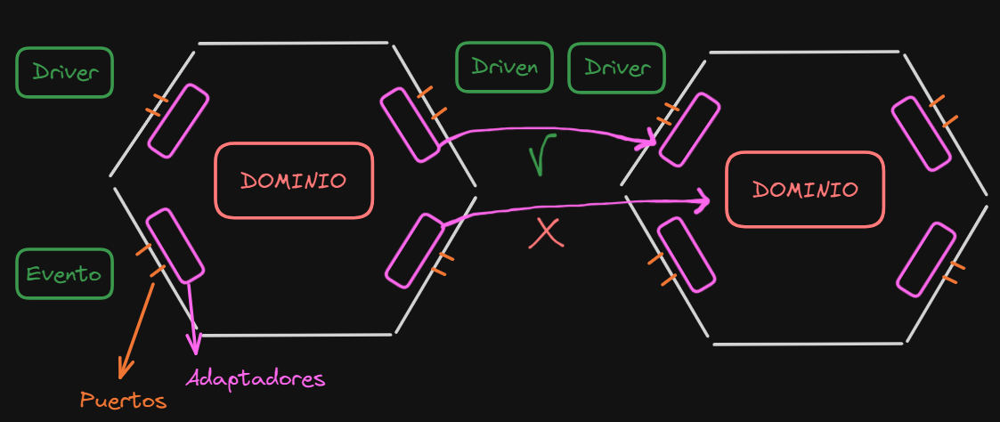

# Hexagonal Architecture

A diferencia con la clean architecture, esta no trabaja con capas, sino con hexagonos. Las ideas son muy similares a la clean architecture.
>  

>  

Esta arquitectura esta pensada de la siguiente manera:

## Dominio

El dominio es la parte central del cada hexagono, y por lo tanto, donde va a estar ubicada toda la lógica. Pero ademas este nunca va a saber que es lo que pasa fuera del mismo, va a contener la logica de funcionamiento pero sin saber como se obtienen/reciben los datos fuera de él.  

## Puertos

Los Puertos, que se van a encargar de limitar las acciones que puede hacer nuestro hexagono. Estos tambien se pueden interpretar como interfaces que determinan un contrato que debe cumplir una entidad.

A su vez, estos no especifican de ninguna manera como es que se van a implementar en los adaptadores, sino que van a definir la forma que van a tener. Por otro lado tenemos que entender que los puertos funcionan para dentro del hexagono, es decir, definen solamente la estructura que se debe manejar en el adaptador.

### Drivers & Drivens

Los puertos que se encuentran del lado izquiero se denominan "Puertos Drivers" y se encargan de definir las interfaces o estructuras que el hexagono va a recibir para la función que vaya a realizar.

Los puertos que se encuentran del lado derecho se denominan "Puertos Drivens" y se encargan de definir las interfaces o estructuras que el hexagono debe enviar 

## Adaptadores

Los adaptadores se encargan de enviar o recibir información, e implementan las interfaces que se definen en los puertos.

### Drivers & Drivens

Los adaptadores que se encuentran del lado izquierdo se denominan "Adaptadores Drivers" y se encargan de implementar las interfaces de los puertos y adaptarlas para que la aplicación pueda realizar sus operaciones correctamente.

Los adaptadores que se encuentran del lado derecho se denominan "Adaptadores Drivens" y se encargan de implementar las interfaces de los puertos y adaptarlas para que puedan ser recibidas por otro adaptador en otro hexagono.

## Eventos

Si bien los eventos son parte de la idea, no forman parte de una manera de estructurar nuestros archivos, ya que es nada mas que un concepto para entender la comunicación en un hexagono o la comunicación entre hexagonos. Ademas son los encargados de dar comienzo al funcionamiento de un hexagono.

### Triggers

Se denomina mas formalmente "Trigger" a los eventos que vienen del lado izquierdo del hexagono. Estos son los "actores primarios" o los gatillos que hacen que el hexagono comience a funcionar. En cambio los eventos del lado derecho son simplemente "actores secundarios" o eventos, pero tambien tenemos que tener en cuenta que estos actores secundarios, son a su vez, actores primarios para otro hexagono.

> 

> [!IMPORTANT]
> Hay que tener en cuenta que la comunicacion entre hexagonos se realiza UNICAMENTE a travez de los adaptadores y sus puertos, nunca un adaptador debe comunicarse directamente con el dominio de otro hexagono.

### Ejemplo:

Supongamos que tenemos nuestro negocio que es un pizzeria, como parte principal vamos a tener la cocina (dominio) que se va a encargar unica y exclusivamente de hacer las pizzas que se van a servir en el negocio. Obviamente la cocina por si sola no es capaz de atender a los clientes (triggers), por lo que van a necesitar de alguien que recepcione los pedidos, estos van a ser los adaptadores, que por medio de un menu (puertos) que define las pizzas que hay y como estan hechas (interfaz), van a comunicar la orden del cliente con la cocina. Esto último es necesario por que lo que para el cliente es una pizza napolitana, para la cocina puede ser una orden n°12.

Tambien tenemos que contemplar que la cocina en algún momento puede quedarse sin insumos necesarios para preparar los productos, por lo que de alguna manera va pedirle a alguien (otro adaptador) que le de lo que necesita. Este adaptador, mediante un puerto que determine su estructura, va a enviar la petición al proveedor (otro hexagono si se quiere).
