# Get Started with Google Analytics

https://www.youtube.com/watch?v=cYaE3wqcbko

Los temas a tratar en esta sección son sobre:

1. Hacer las preguntas correctas.
2. Aprender que herramientas usar.
3. Usar la información de Google Analytics

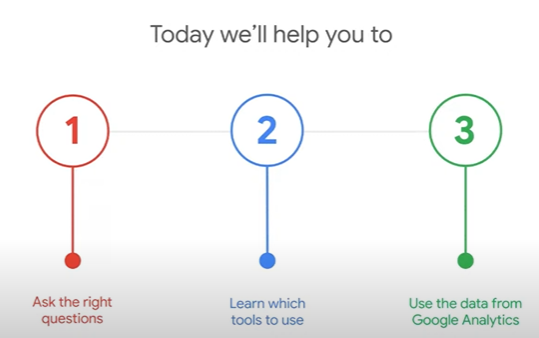

## Hacer las preguntas correctas.

Como pregunta principal debemos responder a cual es nuestro objetivo, para mantener esa mentalidad y apuntar a ello

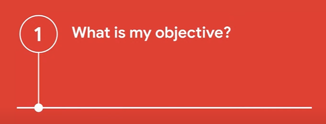

### ¿Cómo encuentras actualmente información sobre el rendimiento de un sitio web en línea?

Es importante que entendamos para que sirven las herramientas de analisis de paginas web y que ventajas nos pueden traer. Además de que la información que nos brindan pueden ayudarnos a tomar mejores decisiones

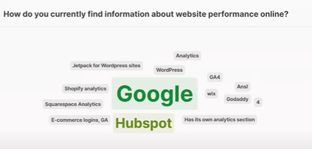

### Guía de preguntas

Para guiarnos en el analisis de la informacion es recomendable que sigamos una serie de preguntas con un unico fin para cada cosa:
1. ¿Cuál es mi objetivo?
2. ¿Qué pregunta necesito abordar?
3. ¿De dónde obtengo esa información?
4. ¿Qué hago con esa información?

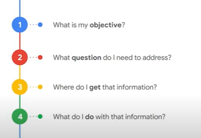

#### ¿Cuál es mi objetivo?

El objetivo es crucial ya que nos permite definir que enfoque va a tener nuestra busqueda de informacion y con que proposito se realiza

podemos querer contarles a mas personas sobre nuestro negocio, vender mas de mi producto o servicio, identificar a los consumidores mas valiosos, encontrar nuevas formas de interactuar con clientes anteriores, etc

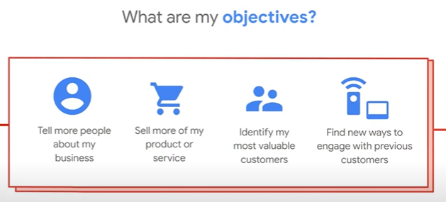

#### ¿Qué pregunta necesito abordar?

Dependiendo lo que estemos buscando, podemos hacernos algunas preguntas como las siguientes:

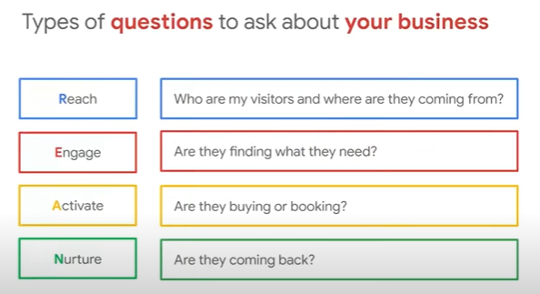

**Reach** - Esta pregunta se enfoca en la visibilidad de tu negocio y en atraer visitantes. La pregunta "Who are my visitors and where are they coming from?" busca identificar el perfil de tu audiencia y de dónde proviene el tráfico (ubicación geográfica, canales de tráfico como redes sociales, motores de búsqueda, busquedas orgánicas, etc.).

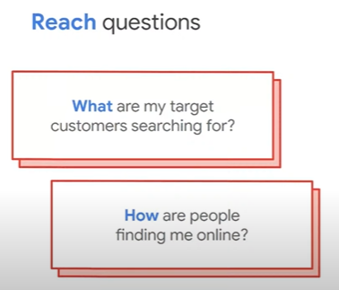

**Engage** - Aquí el objetivo es analizar si los usuarios están interesados en tu contenido o encuentran lo que buscan. La pregunta "Are they finding what they need?" se refiere a si los visitantes están interactuando de manera significativa, como explorando varias páginas o permaneciendo en el sitio lo suficiente para consumir contenido.

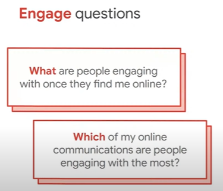

**Activate** - Esta pregunta mide las acciones de conversión, como compras o reservas. La pregunta "Are they buying or booking?" evalúa si el usuario completa una acción clave para tu negocio (completa formularios, llena la informacion de contacto, etc.).

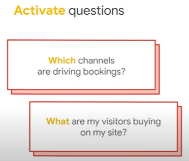

**Nurture** - Aquí se observa la lealtad y retención del usuario. La pregunta "Are they coming back?" se centra en si los visitantes retornan al sitio, lo que indica si están satisfechos o encuentran valor en lo que ofreces.

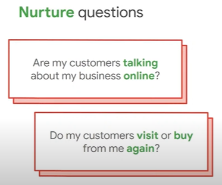

#### ¿De dónde obtengo esa información?

El lugar de donde obtenemos los datos y cuanta información, flexibilidad, detalles, etc. nos brinden, mas facil y rapido nos resultara accionar

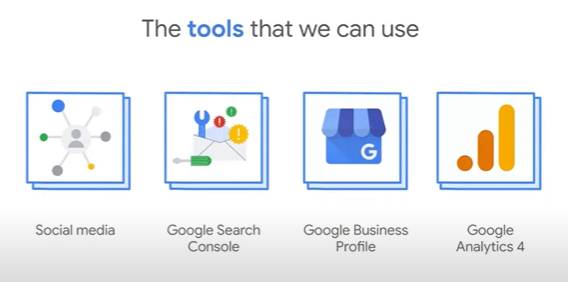

**Redes sociales:** La mayoria de las redes sociales tienen su propia forma de obtener un analisis. 

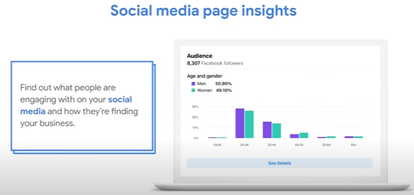

Algunos de los **beneficios** son entender que contenido funciona mejor, obtener informacion demografica, medir el impacto de las campañas publicitarias y entender a que publico te estas dirigiendo (para saber de que manera hablarles).

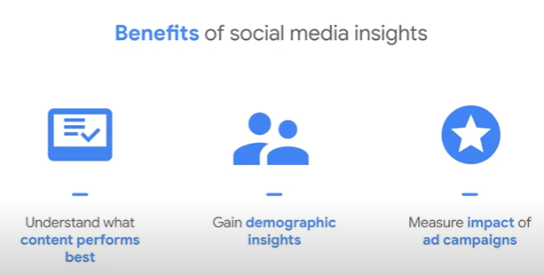

**Los pasos a seguir** en la mayoría de las redes sociales son los siguientes: cambiar tu cuenta a una profesional o de negocio, crear y compartir contenido, revisa las metricas de esa publicacion y compartelas, usa un centro el centro de anuncios de la plataforma que estes usando para medir las metricas del contenido promocionado y considera usar plataformas de terceros para tener mas informacion

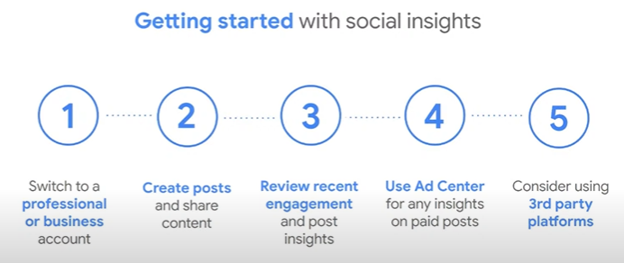

Puedes utilizar herramientas como **Google Search Console** para ver informacion valiosa de los visitantes provenientes de resultados organicos de Google

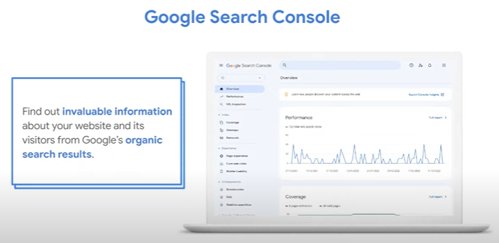

algunos de los **beneficios** son verificar que google pueda encontrar tu pagina, solucionar problemas y recibir alertas sobre nuevos problemas, monitorear que tan seguido aparece tu pagina en el buscador de Google y descubrir en que busquedas se muestra tu pagina

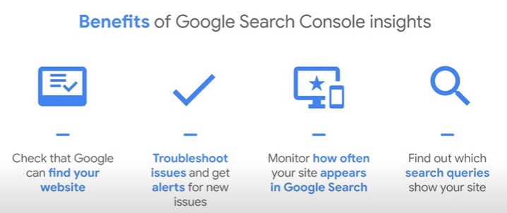

**Los pasos a seguir** para utilizar esta herramienta son: acceder a "g.co/searchconsole", verificar tu pagina, revisar que google haya encontrado todas tus paginas, ver el reciente desempeño de tu pagina y aprender lo básico de las busquedas de Google y SEO

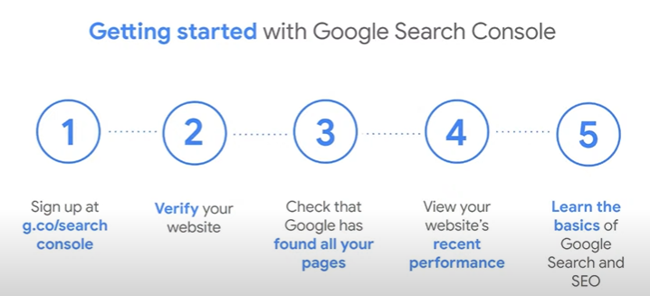

Puedes utilizar herramientas como **Google Business Profile**  para manejar tu presencia online a traves del buscador de Google y Google Maps

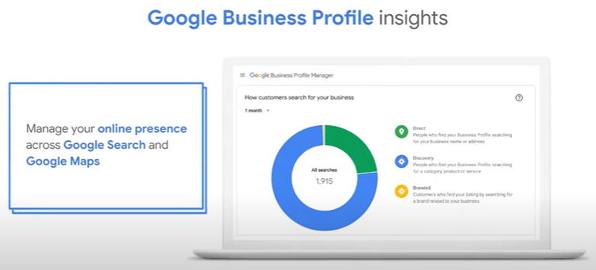

Algunos de los **beneficios** de utilizar esta herramienta son: ver el numero de direcciones solicitadas y clicks en las paginas, ver el numero de personas que clickean en tu perfil de negocio, entender como las personas encuentran tu negocio y que busquedas hacen, y aprovechar la informacion para aparecer en las búsquedas y mapas

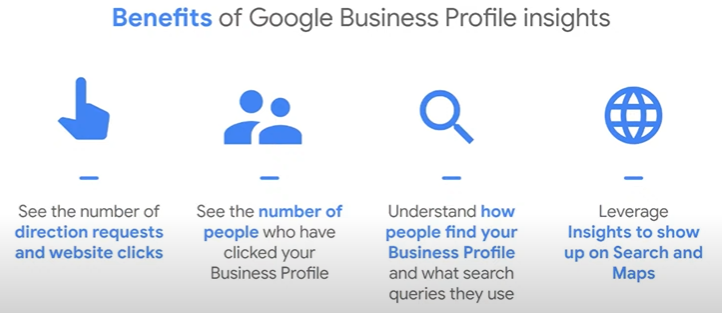

**Los pasos a seguir** para utilizar esta herramienta son: registrarte y loguearte en "business.google.com", buscar en Google el nombre exacto de tu negocio, seleccioná "Promote > Performance" y elegí un rango de fecha para ver la informacion

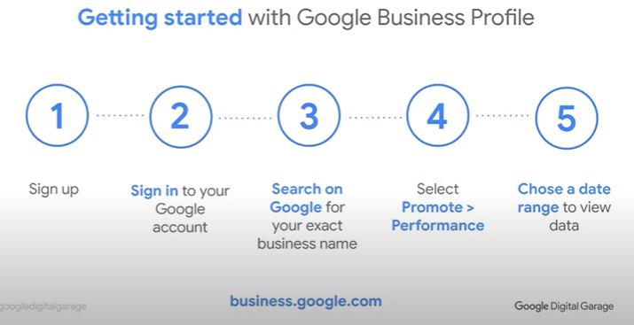

Puedes utilizar herramientas como **PageSpeed Insights** para ver el rendimiento de tu pagina web

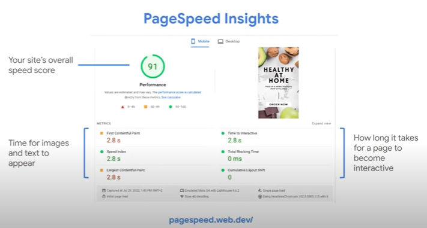

Algunos de los **beneficios** de utilizar esta herramienta son: Ver que tan rapido carga tu pagina, obtener recomendaciones de mejoras, aprender como optimizar tu pagina para que el usuario tenga una mejor experiencia y obtener un reporte completo de tu pagina

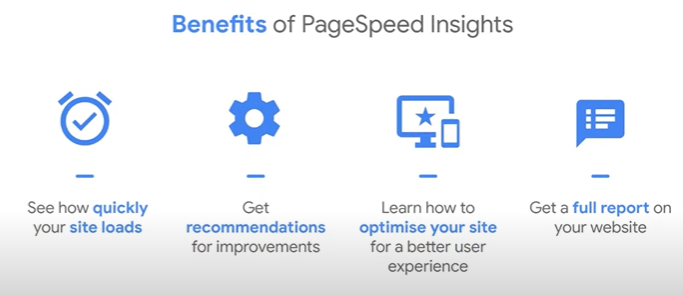

**Los pasos a seguir** para utilizar esta herramienta son: visitar pagespeed.web.dev/, ingresar la URL que deseas revisar, ver la puntuacion y sugerencias, personalizar e implementar mejoras en tu pagina y elegir un rango de fecha para ver la informacion

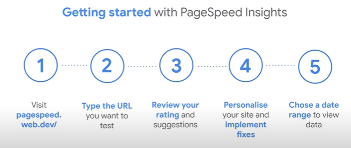

Tambien podes analizar cada click que hace el usuario en tu propia pagina web con Google Analytics y manejar tu presencia online a traves de los buscadores de Google y Google Maps

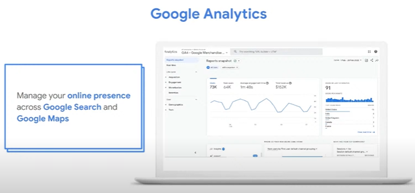

Algunos de los **beneficios** de utilizar esta herramienta son: Evaluar tu rendimiento del marketing, entender el comportamiento de tus clientes, conocer a tus usuarios y sus comportamientos, y enlazar con otros productos de metricas (como Google Ads) para tener una vista mas completa

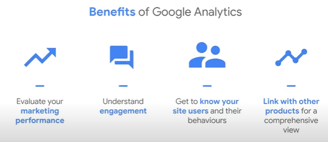

#### ¿Qué hago con esa información?

En esta parte es donde muchos se quedan atascados ya que no saben que hacer con los "numeros" de los datos que obtienen de las analiticas. Saber que hacer con esa informacion o tener un panorama de que es lo que estas buscando cuando obtenes datos, hace mucho la diferencia

**Google Analytics 4**

Google Analytics 4 es la nueva versión que incluye machine learning como corazon, para ayudarte a encontrar insights trends y predicciones a traves de dispositivos

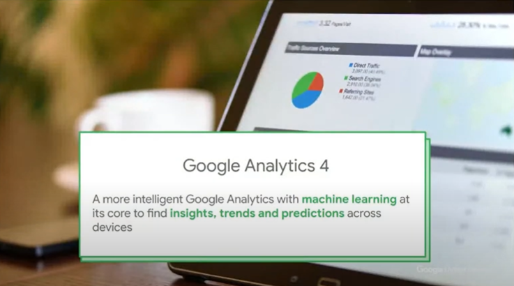

Para cambiar a esta nueva versión tienes que primero haber conectado tu web al mismo (puedes buscar los pasos en el buscador de Google) y luego seguir estos pasos: Ingresar a tu cuenta, navegar hacia el panel administrativo, elegir la propiedad que te gustaria asignar a Google Analytics 4 y hacer click en GA4 Set-up Assistant para luego seguir los pasos que te indique

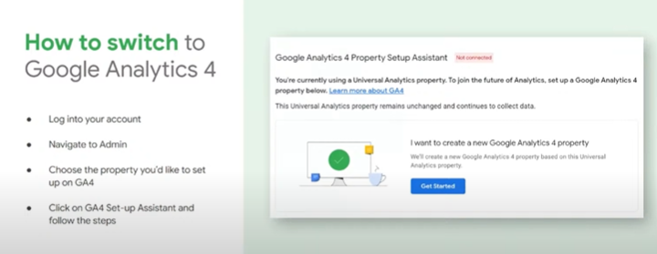

**Reportes de Google Analytics** 

Con esta herramienta podemos generar diferentes tipos de reportes como de "adquisición", "compromiso", "monetizacion" o "retencion". Los de adquisicion serian como de donde vienen mis usuarios, los de compromiso seria de como se comportan los usuarios en mi sitio web, como los usuarios gastan si dinero y los de retencion serian de si los usuarios vuelven. 

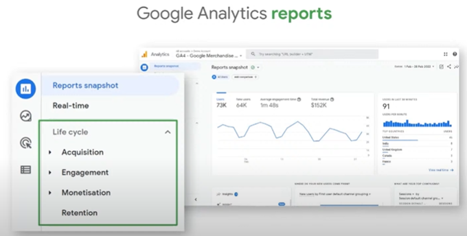

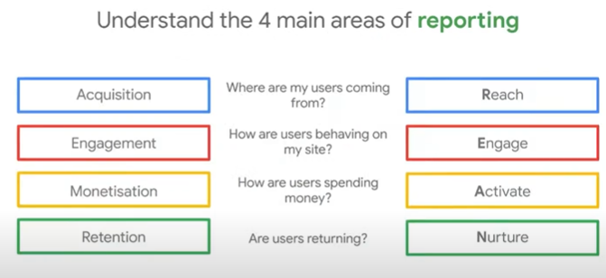
