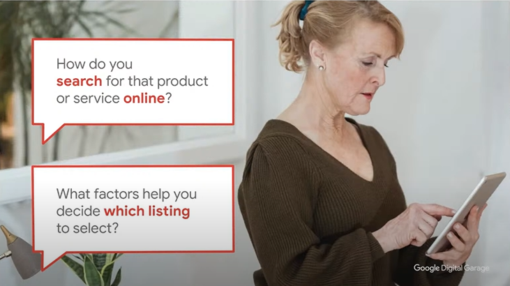
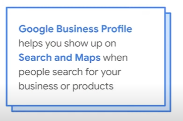
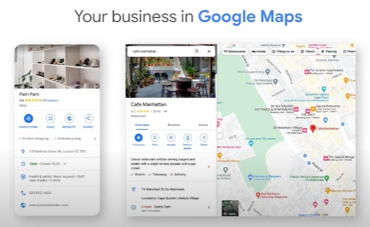

# Get Your Business Visible on Google

(https://www.youtube.com/watch?v=Fiym37h84mI)

## Comprender cómo los cliente encuentran tu negocio en línea 

es importante meternos en la cabeza de nuestra audiencia y clientes para comprender coomo podemos construir una fuerte presencia online
los compradores suelen ivestigar a las marcas en las redes, entonces es importante estar visible

### ¿Cómo utilizan los clientes los motores de búsqueda para buscar empresas y productos?

80% en reino unido compra online  y cada vez aumenta

el 70% de los consumidores buscan resultados de una tienda fisica. Nosotros solemos buscar lo que necesitamos en cualquier momento y previo a decidir ir a una tienda, podemos hacer la busqueda mientras tomamos un cafe, vamos en tren, etc. Por lo general solemos buscarlo en el telefono

el 62% de las personas usan google para comparar productos de diferentes vendedores. Eso realmente muestra que las personas toman sus decisiones basandose en la presentacion de los servicios y productos que encuentran online. Por eso es realmente importante para nosotros tener una imagen clara y concisa para que nuestros clientes y audiencia llegue mas facil a nosotros.

### El camino de la compra online

Aca podemos ver el desorden que tenemos los consumidores a la hora de querer realizar una compra online. Existen demasiadas formas y variables que afectan el recorrido del consumidor. Este no es un camino lineal

solemos tener un caos a la hora de ordenarnos para comprar 
los comentarios son un factor clave para saber que compramos

es muy importante tener una buena presencia en las redes sociales

#### ¿Qué es lo que buscan los consimudores en el medio de ese desorden?

Una cosa importante es se concisos con la informacion y ofrecerla lo mas cerca de la parte superior, para que el potencial cliente entienda y vea en primera plana lo que necesita saber

El poder del ahora: Actualmente a las personas les encanta poder disponer de las cosas en el momento

Pruebas sociales: Un gran determinante de un producto de calidad son las reseñas que tiene de otros consumidores, a esto se le denomina prueba social. pueden ser comentarios o recomendaciones

Sesgo de escasez: la disponibilidad de un producto puede ser un factor importante en la decision, ya que se puede generar esa presion en el comprador de que si no concreta la compra, puede que en un futuro no este disponible. Por ejemplo, si tenemos mas de 4000 productos en stock, es posible que la persona note que tiene tiempo para decidir, en cambio si solo quedan 2, puede crecerle la urgencia de comprarlo en el momento

sesgo de autoridad: es importante que generemos esa autoridad con nuestra marca para que nuestros clientes entiendan que tenemos un gran conocimiento en el area/producto y que pueden confiar en nosotros, porque saben que la marca le da un respaldo de valor al producto/servicio

El poder de lo gratis: Muchas veces nos sentimos atraidos a comprar algo sabiendo que recibimos algo gratis ademas del producto. Puede ser algo agregado al producto u obtener un cafe gratis luego de varias compras.

#### Ayuda a los consumidores a salir de ese desorden

construir tu marca y asegurarte que tenga una buena presencia online va a ayudarte mucho, pero debes asegurarte que tu presencia esté en las redes sociales, websites, etc. que tu logo muestre la seguridad que tu marca ofrece.

Tenemso que cerrar el "gap" que existe entre el el "trigger", que seria como el gatillo del cliente para cuando empieza una busqueda sobre un producto, este puede ser la busqueda en el motor de busqueda, y el momento en el que el cliente decide comprar. Necesitamos ofrecer al cliente la mayor informacion posible (y de facil acceso) para que encuentre rapido lo que necesita y asegurar la compra, pueden ser blogs, articulos, videos, shorts en youtube, instagram, etc. No tenemos que dar por hecho que el cliente sabe y conoce lo suficiente del producto como para no brindarle toda la informacion necesaria.

Tambien debemos hacer facil que el cliente tome una decision y compre. Debemos hacer ofertas irresistibles, debemos motivarlos a tomar una decision rapido.

#### ¿Por qué es importante la "busqueda"?

Aca es donde generalmente el cliente va a comenzar su camino de compra. 

Cuando abrimos un negocio fisico esperamos que los clientes pasen por la puerta y entren, el concepto de construir y que los clientes lleguen por "si solos" no es realmente aplicable al mundo online. En este debemos hacer que ellos nos puedan encontrar.

En terminos de no estar ahi para cuando el cliente realiza una busqueda por el servicio/producto que nosotros ofrecemos, es una gran perdida de opotunidad, y esto es algo que para nada debemos de dejar pasar por alto. Entonces, estar ahi para cuando un cliente busca lo que ofrecemos, es realmente muy muy importante

es importante que entendamos y nos pongamos en los zapatos de un cliente cuando esta buscando algo, como por ejemplo "pizzas cerca de mi", que resultados nos arroja y por qué elegimos el que elegimos, o sino yendo a un paso previo, que opciones nos arroja el buscador antes de seleccionar la busqueda yu por qué elegimos esa. Que factores vemos en la pantalla que nos ayudan a resolver nuestra busqueda. Otros parametros que debemos plantearnos son por las cosas que nos influenciamos, "me influencio por las fotos", "me influencio por los precios", "por los comentarios", etc.

Ahora, tambien como mencionamos previamente, el telefono es la herramienta predilecta cuando realizamos estas busquedas, ya que por lo general las solemos buscar cuando estamos "yendo" hacia esa compra. Esto es algo sumamente importante ya que pensar en la herramienta que el usuario va a disponer para buscar el producto que vos ofreces nos va a dar una mejor vision de como debemos apuntar y optimizar nuestras campañas publicitarias, redes sociales, paginas en linea, etc.

#### ¿Cómo los consumidores encuentran productos?

Podemos pensarlo en referencia a como nosotros buscamos algo y como lo hicimos con el paso del tiempo. A lo largo del tiempo las busquedas suelen ser mucho mas especificas y acertadas hacia como obtenemos los resultados como queremos, ya que nos damos cuenta que resultados arrojan ciertas consultas. Nosotros estamos interesados en un tópico y hacemos una busqueda sobre eso, pero este a su vez tiene lo que se denominan modificadores y que serian aquello que nosotros queremos saber sobre ese topico, como por ejemplo, "cerca de mi", "barato", "el mejor", etc.

A lo largo del tiempo las busquedas fueron variando. La forma en que se busca, los modificadores que se usan y las tendencias del momento

#### Comprender el comportamiento de búsqueda con Google trends

Google Trends es una gran herramienta que nos permite ver las busquedas mas detacadas en el ultimo tiempo (o el que querramos) y que nos puede ayudar a entender mejor hacia donde debemos enfocarnos como marca respecto de nuestro producto/servicio.

#### Usa Google Ads Insights para entender a tus usuarios

Es otra gran herramienta que puede ayudarte mucho a saber que es lo que tus usuarios necesitan y ajustar tus campañas acorde a estas, ya que toda la informacion que puedas obtener de ellos, va a resultarte muy util a la hora de mejorar tu producot/servicio en pos de ellos. 

## Construir nuestra presencia en Google Maps y en los buscadores

Puedes encontrar 4 tipos diferentes de resultados en Google.

Puedes encontrar resultados promocionados, que son empresas que pagan por aparecer en ciertas busquedas

Tambien puedes encontrar perfiles de negocios de google. Esta es una muy buena manera de tener una presencia online si es que no dispones de una pagina o red social

Las busquedas organicas, que van a ser el mayor porcentaje de los resultados, ya que el objetivo principal de google es mostrarte los resultados mas adecuados a la busqueda que estas haciendo.

Por ultimo tenemos las tiendas de compra de google, una buena herramienta que podemos utilizar para comparar precios, negocios, calidades, etc

#### Optimización para los motores de búsqueda

Esta es una práctica que consiste en incrementar la cantidad y calidad del trafico de tu pagina a traves de los resultados organicos en los motores de busqueda

el contenido es uno de los requisitos mas importantes para optimizar, darle al cliente, el contenido que busca

Tambien se conoce como SEO

### Descubre como Google ve tu sitio web

Google Search Console es una gran herramienta que te va a ayudar a conocer caracteristicas esenciales sobre tu sitio web y como google lo "ve" y lee. Ademas te permite motinorizar el rendimiento del mismo

### Requerimientos del SEO

Existen un monton de cosas que podemos hacer para mejorar el SEO, pero algunas de ellas son:

Que tu sitio pueda ser encontrado
que tu pagina funcione
que google pueda leer el contenido
evitar el relleno de palabras claves
evitar las amenzas ciberneticas
evitar el plagio

### Buenas prácticas de SEO

Crear contenido útil, confiable y centrado en las personas.
Usa palabras claves de google trends
Haz que tus enlaces sean rastreables
Cuéntale a la gente sobre tu sitio
sigue las buenas practicas para imagenes, videos, informacion estructurada y javascript
Mejora la apariencia de tu sitio en la búsqueda de Google
Controla como tu contenido aparece en google 

### PageSpeed Insights

Esta herramienta es muy útil y te va a ayudar muchisimo a la hora de medir los tiempos de carga de tu pagina en diferentes dispositivos, como esta funcionando y muchas otras metricas 

### SEM (Search Engine Marketing)

Es utilizar publicidad paga para garantizar que los productos o servicios de una empresa sean visibles en las páginas de resultados de los motores de búsqueda.

### Pasos para crear un anuncio en el buscador

Primero debemos crear una campaña en Google Ads
Establezca su objetivo y oferta
Deje que los anuncios de máximo rendimiento hagan el resto

estos anuncios de maximo rendimiento, cuanto mejor informacion sobre tu producto/servicio le brindes, mejores van a ser los resultados

### Google Business Profile

Esta herramienta te va a ayudar a aparecer en los motores de busqueda y en el Maps cuando las personas busquen por tu empresa o servicio/producto

### Pasos para crear un perfil en Google Business Profile

Empezar en la pagina (business.google.com)
Agregar o seleccionar tu negocio
Ingresar tu informacion
Verificar tus listados

### Optimzar tu Google Business Profile

Agregar horas de apertura
agrega fotos para atraer a visitantes
contesta a los comentarios para generar confianza

Crea nuevas publicaciones para decirles a tus consumidores sobre lo nuevo
es muy importante mantenerte actualizado
cuentales porque estas haciendo eso nuevo, cuando lo vas a hacer, a quien se lo vas a hacer, etc

### Utiliza insight para impulsar tu marketing digital

Google business Profile ofrece estas y algunas analiticas que te van a ayudar mucho, principalmente para tomar decisiones futuras y darnos cuenta de lo que funciona, cuanto tiempo miran una foto, a que le estan prestando atencion, etc

## Mostrar tus productos en Google

### Google Shopping

Esta es una gran herramienta y que mas la utilizam mas de un millon de veces al día. Te ayuda a desplegar tu inventario, productos, etc.
Ademas te brinda varias secciones para que completes con informacion y puedas darle al cliente lo que busca o necesita para comprar.

Muestra tus productos con Google Merchant Center, puede ser en los motores de busqueda, Maps o YouTube.

### ¿Cómo funciona Merchant Center?

Primero tienes que agregar tus productos
Luego estos van a aparecer en la pestaña de "Shopping"
Y por ultimo los clientes van a poder hacer click en tus productos

Cuando los clientes hagan click sobre tus anuncios, van a ser redirigidos a tu pagina web

### Automatiza con Merchant Center Next

Puedes automatizar algunas tareas con Merchant Center Next

### Conviertete en un profesional local de confianza

Registrate como proveedor de servicios
ingresa tu presupuesto
Comienza con tus anuncios en google

