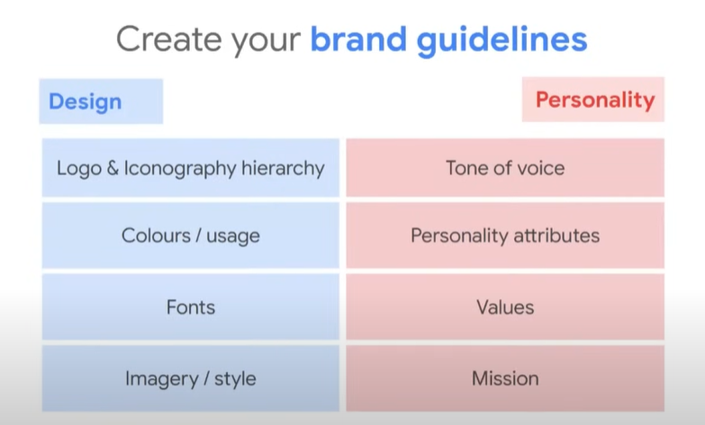
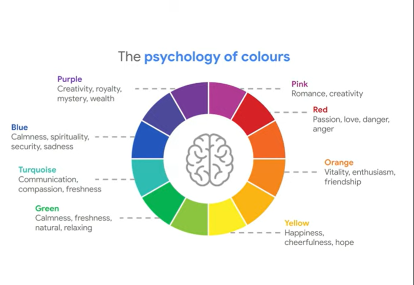

# Grow your bussines brand

## Pautas para construir tu marca

En primera instancia vamos investigar de que se trata y por qué es tan importante.  

### ¿Qué hace que una marca se destaque en línea para vos?

Esta es una de las cosas que nos tenemos que plantear en un principio para poder avanzar y encontrar que cosas necesita nuestra marca. Tenemos que evaluar cuestiones como por ejemplo, que diferencian a las marcas, a que público esta enfocado, etc.  

### Beneficios de invertir en tu marca

* Destacar entre otros negocios: Los consumidores estan expuestos todo el día a nuevas marcas, por lo que tener una identidad clara y ser más memorables, va a ayudarnos a ser reconocidos cada vez que aparezcamos y los clientes van a recordarnos con mayor facilidad.  

* Construir confianza para con los clientes: Tener un objetivo claro de como queremos construir esta confianza es indispensable, para esto podemos pensar en tener bien en claro como vamos a prensentarnos en la web, en las redes sociales u otras plataformas digitales. Debemos mostrarles a nuestro clientes que somos una empresa confiable, que estamos establecido y también hacerles saber a nuestros clientes que es lo que pueden esperar de nosotros.  

* Incrementar la lealtad de los clientes: Vamos a querer crear una conexión con nuestros clientes, la marca genera una personalidad sobre el negocio, por lo que un papel muy importante es la emoción que le generes al cliente, y a la cual vamos a acudir para cuando querramos fidelizar a nuestra audiencia. También vamos a querer darle ese toque humano a nuestra marca, para justamente fortalecer estas emociones y que nos ayuden en nuestro objetivo. Por otro lado, esto tambien nos va a ayudar al trabajo en equipo y a hacer que nuestros trabajadores se sientan mucho mas a gusto.  

### ¿Qué pautas incluye tu marca?

Existen una serie de cosas que debemos plantearnos y considerar. Obviamente nuestra marca va a tener un diseño, pero también debe tener una personalidad.  

  

## Da vida a tu marca en la web

## Usa herramientas para optimizar tu marca

# La Psicología de los Colores

